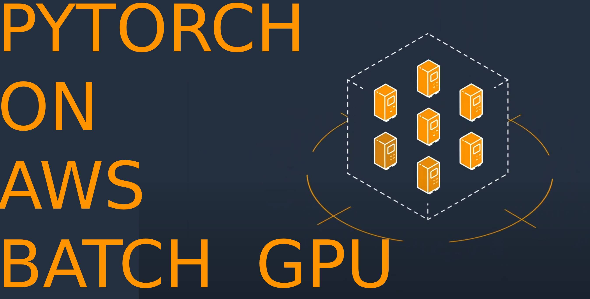

## Run Pytorch Cost Effectively At Scale With AWS Batch:

Check out the Youtube video explaining this project [here](https://youtu.be/24ICSXJqm7A)
[](https://youtu.be/24ICSXJqm7A)


### Overview: 


#### What is AWS Batch?
AWS Batch manages scaling up and down EC2 resources automatically to handle load when you need it and scale down to cut costs when you don't need compute resources.

It also queues up and runs many jobs in the for of Docker Tasks.

#### What is CloudFormation?
An AWS Service to build AWS Infrastructure as code so it can be version controlled and used to enforce standards easily. 


### Getting Started:
#### Step 0 - Setup your source:
##### Step 1A - Fork the Repo(Going away soon):
You can fork this repo and then [create a AWS CodeStar Connection](https://docs.aws.amazon.com/dtconsole/latest/userguide/connections-create.html) so that you can make edits to this.  
The main reason for this is that you need to get access to the Github repo.

The screen you navigate to on AWS CloudFormation should have a list of all the resources you will be booting up.
##### CodeStarConnectionARN:
https://docs.aws.amazon.com/dtconsole/latest/userguide/connections-create.html

##### Step 1B - Create an S3 Bucket and upload the source:
(Coming Soon)
The build pipeline will just grab whatever source code you push up to the S3 bucket. So download this project, modify the commands in the `node` folder as you see fit.

If you leave it as the default `SourceCodeBucket` value it will just pull from my public S3 bucket it will boot up the demo.


#### Step 1 - Boot it up:
While being logged in to your AWS Account run the CloudFormation script by clicking the link below:

[](https://us-east-1.console.aws.amazon.com/cloudformation/home?region=us-east-1#/stacks/create/review?templateURL=https://sc-cloud-formation-v1.s3.amazonaws.com/cf-pytorch-gpu-service.json&stackName=schematical-pytorch-gpu-service)


#### Step 2 - Test it:
NOTE: Remember because of the EFS setup the first run will take a lot longer because it caches a lot of important things. After that it should run a lot faster.

You can test it in one of 3 ways:
##### AWS Console: 
You can use the [AWS Batch Jobs Console](https://us-east-1.console.aws.amazon.com/batch/home?region=us-east-1#jobs) (be sure to select your region).

1) Click `Submit Job`
2) Select the Job Definition named after your service
3) Select the Job Queue named after your service
4) (Optional) Tweak any parameters you want
5) Send it!


##### AWS Cli:
You can use the [cli to test](https://docs.aws.amazon.com/cli/latest/reference/batch/submit-job.html).

Here is an example of what that might look like. If you changed the `ServiceName`, `Env`, or `Region` make sure to update it and double-check your JobDefinition revision number.
```
aws batch submit-job --job-name MyTestJob --job-queue pytorch-gpu-service-v1-dev-us-east-1 --job-definition pytorch-gpu-service-v1-dev-us-east-1:1
```

#### SDK:
Pick your [favorite AWS SDK](https://aws.amazon.com/developer/tools/) and have at it!


#### Step 3 - Scale it:
You can scale the amount of compute resources that AWS Batch will boot up on EC2 by changing the `MaxvCpus` and `MaxvCpus`.

1) Open up the [cf-pytorch-gpu-service.json](./cf-pytorch-gpu-service.json)
2) Navigate to `Resources` > `BatchGPUComputeEnvironment` > `ComputeResources` that should have child fields of  `MaxvCpus` and `MaxvCpus`
3) If you edit the `MaxvCpus` that will increase the amount of servers AWS will boot up on your behalf.
4) If you edit the `MinvCpus` that will set the minimum amount of AWS instances running at once. Assuming you are using the default `g4dn.2xlarge` instance type setting this to `8` will always keep one instance running.
5) If you want to change the instance size change the `InstanceTypes` param (TODO: Make this an array). You can pick any of the [g4](https://aws.amazon.com/ec2/instance-types/g4)/[g5](https://aws.amazon.com/ec2/instance-types/g5/) (not `g5g` oddly enough).


### Support:
Interested in supporting me as I maintain these free scripts? Click the link below:

<a href="https://www.buymeacoffee.com/schematical" target="_blank"></a>


### Need Help:

#### Jump On The Discord:
This stuff can be a bit complex. Luckily we have a small community of people that like to help.
So head on over to the [Discord](https://discord.gg/F6cErPe6VJ) and feel free to ask any questions you might have.

#### Need more help:
I do consult on this so feel free to hop on over to [Schematical.com](https://schematical.com?utm_source=github_cf-pytorch-gpu-service) and signup for a consultation.  


### Other scripts:
I am working on standardizing some other scripts we commonly use with our consulting clients and 
open sourcing them for anyone who wants to use them to use.
https://github.com/schematical/sc-cloudformation

Of course if you want more hands on help with them or help training your team on how to use them feel free to reach out to us at [Schematical.com](https://schematical.com?utm_source=github_cf-pytorch-gpu-service). 


### NOTES:
It is NOT necessary but if you are going to try the super advanced move of running a custom AMI
I created the original custom AMI from Ubutu 20.04 with GPU Support. Specifically `ami-045a50425ac09a3f5` and Instance type `g4dn.xlarge`.


#### Helpful Links for building the AMI:

https://docs.aws.amazon.com/batch/latest/userguide/create-batch-ami.html
https://aws.amazon.com/premiumsupport/knowledge-center/ecs-create-custom-AMIs/
https://docs.aws.amazon.com/AmazonECS/latest/developerguide/ecs-agent-install.html
https://docs.nvidia.com/datacenter/cloud-native/container-toolkit/install-guide.html
https://docs.amazonaws.cn/en_us/AmazonECS/latest/developerguide/bootstrap_container_instance.html
https://github.com/aws/amazon-ecs-init
https://docs.aws.amazon.com/AmazonECS/latest/developerguide/ecs-agent-config.html

#### Notes on Optimizing Docker Image Size:
https://www.augmentedmind.de/2022/02/06/optimize-docker-image-size/#:~:text=Often%20a%20Docker%20image%20becomes,not%20to%20run%20your%20application.
https://docs.aws.amazon.com/AmazonECS/latest/developerguide/bind-mounts.html
## Notes:
#### Random Resources:
https://medium.com/@michael.smith.qs2/how-to-use-gpus-quickly-and-cheaply-with-aws-batch-and-pytorch-1209320c4e6b
https://towardsdatascience.com/a-complete-guide-to-building-a-docker-image-serving-a-machine-learning-system-in-production-d8b5b0533bde
#### On Instance Run Command:
```
sudo docker run --rm --runtime=nvidia --gpus all 368590945923.dkr.ecr.us-east-1.amazonaws.com/dreambooth-worker-v1-prod-us-east-1:prod -it bash
```
#### Error: `Reason : "RESOURCE:GPU"
In case anyone else stumbles upon this in the future if your using a custom AMI and the ECS agent you need to make sure that you set ECS_ENABLE_GPU_SUPPORT to true in your /etc/ecs/ecs.config or via env vars like the link below.
https://docs.aws.amazon.com/AmazonECS/latest/developerguide/ecs-agent-config.html#:~:text=ECS_ENABLE_GPU_SUPPORT

### If the Container Instance is failing to register make sure the `/var/lib/ecs/data/agent.db` is not saved on the AMI: 
Rebuild base AMI with this https://stackoverflow.com/questions/39018180/aws-ecs-agent-wont-start
```
sudo rm /var/lib/ecs/data/agent.db
sudo systemctl restart ecs
sudo systemctl status ecs
```
Possibly remove on start: https://askubuntu.com/questions/814/how-to-run-scripts-on-start-up

tail /var/log/ecs/*.log -n 100

#### Cache Checkpoints:
/root/.cache/torch/hub/checkpoints
/root/.cache
#### Optimize for SPOT

sudo mount -t efs -o tls,accesspoint=fs-08dbc4cbdd42b5d3b fs-08dbc4cbdd42b5d3b.efs.us-east-1.amazonaws.com /mnt/efs/


aws cloudformation validate-template --template-body file://
